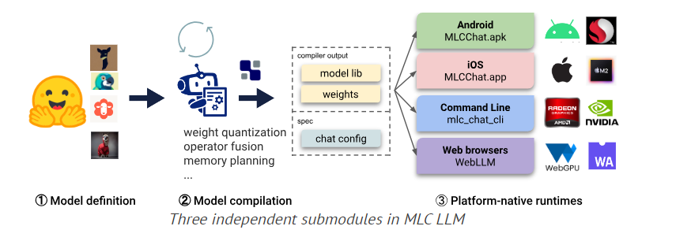
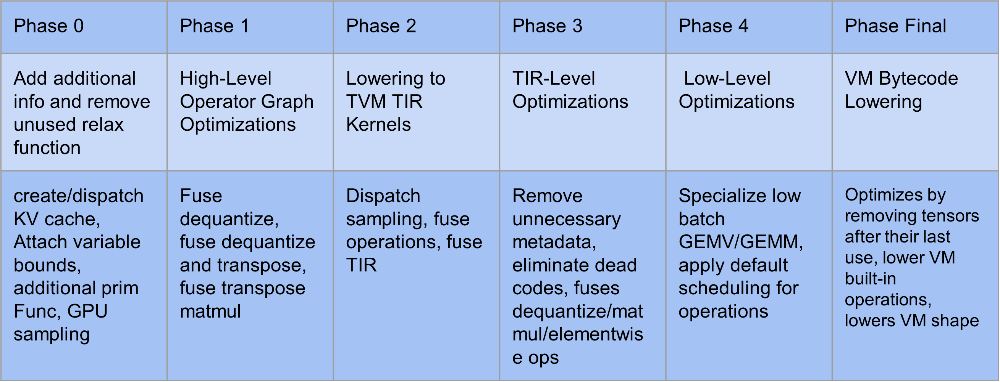
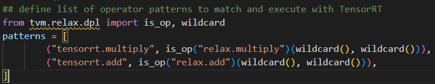
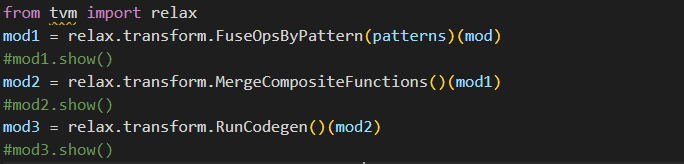
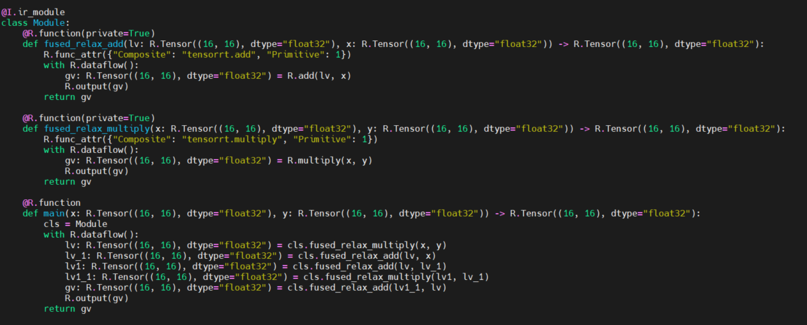

### Recap
#### Primary objective: Estimate cost of LLM running on Hardware accelerator for different Quantization techniques: per-Tensor, per-embedding, per token, group quantization etc

1. Integrate TENET into TVM Relax VM 
2. Estimate the cost in terms of latency, MACs used and Possibly bandwidth
3. TENET takes as input: the Hardware configuration(PE size, statement and mapping), the workload dimension(i, j, k) and the tiling factor(t)

### This weeks's work:
* Study how MLC-LLM Compiles/Runs models and possibility on how to extract the parameters for TENET

#### Workflow of MLC

During model compilation the model goes through these following steps:
* Export to TVM unity compiler 
* Run optimizations using TVM-unity(IRModule->IRModule->VM Bytecode) [pipeline.py](https://github.com/mlc-ai/mlc-llm/blob/main/python/mlc_llm/compiler_pass/pipeline.py) and [compile.py](https://github.com/mlc-ai/mlc-llm/blob/main/python/mlc_llm/interface/compile.py)
    * Phase 0: add additional information & remove unused relax function
    * Phase 1: High-Level Operator Graph Optimizations
    * Phase 2: Lowering to TVM TIR kernels
    * Phase 3: TIR-Level optimizations
    * Phase 4: TVM Dlight opptimizations
    * Final Phase: Lowering to VM bytecode 
* Run model library(.so) on platform-native runtime

#### Issues faced now
1. MLC-LLM Compilation(when built with source) is done for GPUs therefore the optimizations are for GPU architectures(Cuda, ROCm, VUlkan and OpenCL)
2. Since the primary goal is to profile TVM relax VM, not sure if the .so file is runnable on tvm relax vm or only native

# Discussion with Prof. Liou
* process until phase 4 to do tiling and scheduling
* specify the parameters, how they do the tiling and scheduling based on the tenet model
* Retrieve parameters based on Tenet model to upply the tenet the dimension to get the estimation on the latency etc

2 possibilities:
1- BYOC flows: inject specialized hardware to match specialized TIR function
Throwback: Do my own tiling scheduling because TIR is matched very early for BYOC and will modify the optimization phase 
2- Delay the scheduling/break down operators as much as possible without matching any early implementation 
* delay the representation of for loop to match part of the for loop. 
match internal loop, as type function 

* Go through this with CPU model because CPU model can match GEMM for some numerical library
* If it's not possible to run on CPU without modifying heavily the compilation step -> use BLAS numerical library(translate to Blas instead Cuda)

### 6/27
1. re-install Cuda v11.8
2. install tensorrt-8.5
3. build tvm-unity with tensorRT on

### 7/4
### Recap
1. Use of BYOC to integrate TENET
2. 

### MLC-Course
1. Tensor Program Abstraction
2. Computational Graph Optimization
3. BYOC - for my Computational Graph Optimization

#### Option-1 TVM BYOC
* Based on operator
* Need to set the pattern early after on, IRModule is obtained to match BYOC in C++ code.

##### Step flow
1. Define an IRModule

2. Define a list of Operator patterns we want to match with our BYOC

3. Run module through a series of passes, with tvm.transform.sequential mostly unless using single passes. For example, with FuseOpsByPattern etc below

and the module after FuseOpsByPattern looks like this

4. Build and Run the model on the VM.
* error when running on my PC, possibly due to different version of TensorRT or some errors inside the VM

#### Option-2 Modify IRModule, optimize the IRModule by using Pattern match and rewriting techniques in such way that it matches TENET requirement

* Step flow
1. Export IRModule
2. Lower IRModule to TensorIR
3. Find "Matmul" method
4. Modify the method to match our Hardware
