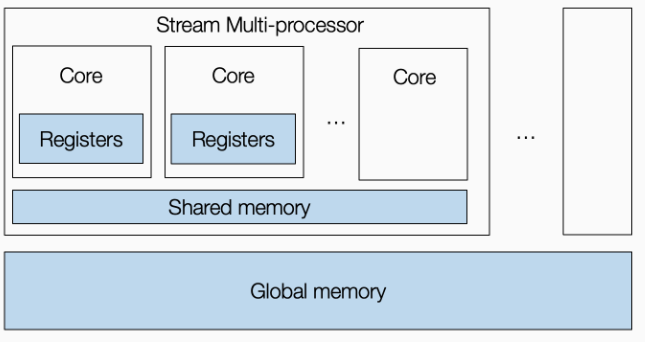
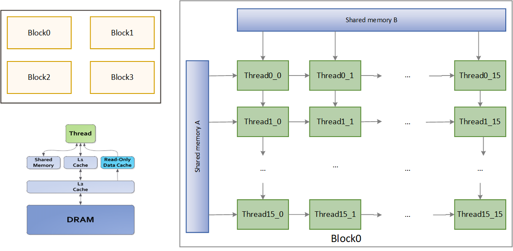

# Adding Custom 16x16 Systolic Array into TVM

As our goal will be to estimate the cost of hardware accelerator executing LLM, by using TENET ACE framework to estimate the hardware performance based on interconnection topology, hardware configuration and workload dimension and tiling factor. We think it would be best to fit our proposed hardware into GPU. There are 2 reasons for that:

1. The TENET framework doesn't support GPU architecture but some interconnection technologies like: 1D, 2D systolic array, and Mesh.
2. MLC-LLM restraints us from using other hardwares for now. In the future some other devices may be added but now we are limited to use GPUs

## Fitting the Systolic Array into GPU

A typical GPU architecture looks like the figure below. A GPU will have a number of streaming multiprocessors within which there are a set of cores.

To program GPU, a programmer needs to create a set of thread blocks, where each thread is mapped to the cores and the thread block is mapped to the stream multiprocessors. Below figure illustrates my 16x16 systolic array. It will contain two shared memories behaving as buffers on the hardware accelerator. The GPU is programmed to behave like a systolic array, Each PE is mapped to one core/cuda thread and the whole PE grid(16x16) is mapped to one SM/cuda thread block. The Matrix input A's will be flowing horizontally and B's flow vertically. 

### Breakdown
* gridDim = (1, 1) and blockDim = (16, 16)
* Shared memory matrices of size 16x16 are allocated for each block, allow threads in block to load data from global memory, reducing memory access
* Tiling with

Limitations: 1 Block number of thread cannot exceed 

[References]
1. https://developer.nvidia.com/blog/easy-introduction-cuda-c-and-c/

Here’s a detailed workflow for finding the best scheduling for matrix multiplication, simulating a 16x16 systolic array, and leveraging TENET for performance estimation. This process combines manual scheduling with automated tuning in TVM.

Workflow for Systolic Array-like Matrix Multiplication Optimization
1. Problem Definition and Initial TIR
Start with a general GEMM TIR (Tensor Intermediate Representation), which expresses the matrix multiplication as a nested loop over the dimensions of the matrices 
𝑀
M, 
𝑁
N, and 
𝐾
K.
Use shared memory in the TIR to simulate the local memory of the systolic array for the input matrices A and B, and local memory for the accumulator (C).
2. Define Search Space for Tiling and Blocking
Tile sizes: Start with a defined search space for the tiling factors of the dimensions 
𝑀
M, 
𝑁
N, and 
𝐾
K. For example, explore factors like [8, 16, 32, 64].
Thread bindings: Use different thread binding strategies to map the computation to GPU threads. The thread hierarchy should reflect how systolic arrays perform parallelism (e.g., tile into 16x16 blocks).
Block sizes: Determine whether one large block or multiple smaller blocks would work better.
python
Copy code
# Example search space for tiling factors:
tiling_factors = {
    'M': [8, 16, 32],
    'N': [8, 16, 32],
    'K': [16, 32],
}
3. Implement Custom Scheduling
Write a custom scheduling function that:
Splits the loops: Split the 
𝑀
M, 
𝑁
N, and 
𝐾
K loops into tiles.
Bind loops to GPU threads: Ensure that the appropriate loops are bound to CUDA threads and blocks.
Shared memory handling: Cache matrix A and B into shared memory to simulate local memory behavior.
Matrix multiplication accumulation: Simulate the partial accumulation behavior using shared memory for input tiles and local memory for the accumulator.
Tensorization: Optionally use tensor intrinsics to optimize for hardware like tensor cores or systolic array-like intrinsics (if applicable).
python
Copy code
def scheduler_16x16(sch):
    # Schedule definition for 16x16 systolic array
    block = sch.get_block("C")
    i, j, k = sch.get_loops(block)

    # Tile loops for systolic array simulation
    i_outer, i_inner = sch.split(i, factors=[None, 16])
    j_outer, j_inner = sch.split(j, factors=[None, 16])
    k_outer, k_inner = sch.split(k, factors=[None, 16])

    # Bind loops to threads (one block with 16x16 threads)
    sch.bind(i_outer, "blockIdx.y")
    sch.bind(j_outer, "blockIdx.x")
    sch.bind(i_inner, "threadIdx.y")
    sch.bind(j_inner, "threadIdx.x")

    # Cache reads and writes to shared memory
    A_shared = sch.cache_read(block, 0, "shared")
    B_shared = sch.cache_read(block, 1, "shared")
    sch.compute_at(A_shared, k_outer)
    sch.compute_at(B_shared, k_outer)
    
    # Cache C to local memory
    C_local = sch.cache_write(block, 0, "local")
    sch.reverse_compute_at(C_local, j_inner)

    return sch
4. Use TVM’s AutoScheduler to Automate Search
Use TVM’s AutoScheduler to explore different configurations. AutoScheduler will:
Explore the space of tiling factors.
Try different thread bindings and memory caching strategies.
python
Copy code
# Example use of AutoScheduler
from tvm import auto_scheduler

task = auto_scheduler.SearchTask(
    func=matrix_multiplication_task,  # The matrix multiplication TIR function
    args=(A, B, C),                   # Arguments (matrix shapes)
    target="cuda"                     # Target (e.g., NVIDIA GPU)
)

# Use AutoScheduler to find the best schedule
tune_options = auto_scheduler.TuningOptions(
    num_measure_trials=200,  # Number of schedules to try
    early_stopping=50,       # Stop early if performance stops improving
    measure_callbacks=[auto_scheduler.RecordToFile("log.json")],
)

# Search for the best schedule
sch, args = auto_scheduler.auto_schedule(task)
5. Extract Workload Dimensions for TENET
Extract the matrix dimensions 
𝑀
M, 
𝑁
N, 
𝐾
K, and tiling factors from the schedule.
For each generated schedule (from AutoScheduler or manual scheduling), extract the performance-relevant information to feed into TENET.
python
Copy code
# Extract tiling factors
M_tiling_factor = get_tiling_factor_from_schedule(sch, 'M')
N_tiling_factor = get_tiling_factor_from_schedule(sch, 'N')
K_tiling_factor = get_tiling_factor_from_schedule(sch, 'K')

# Pass workload dimensions and tiling factors to TENET
tenet_input = {
    'M': 1024,
    'N': 1024,
    'K': 1024,
    'M_tile': M_tiling_factor,
    'N_tile': N_tiling_factor,
    'K_tile': K_tiling_factor,
}
# Estimate performance using TENET (use proper API or script for ACE)
estimated_cost = TENET_ACE(tenet_input)
6. Iteratively Tune and Refine
Tune for performance: Run multiple iterations with different scheduling configurations.
Use the AutoTVM or AutoScheduler to refine the search space based on TENET’s feedback on cost estimation (e.g., energy or latency).
7. Evaluate the Results
Once the auto-tuning is complete and you have evaluated multiple configurations:
Compare their performance based on metrics like execution time, energy efficiency, and memory bandwidth.
Select the best-performing schedule configuration for deployment.
Summary of Steps:
Problem definition: Start with general TIR and systolic array simulation.
Search space design: Define the tiling factors and thread bindings.
Custom scheduling: Implement a custom scheduler for systolic array-like behavior.
AutoScheduler for exploration: Automate the search for optimal schedules.
TENET integration: Pass tiling factors and workload dimensions to TENET for cost estimation.
Iterate and refine: Use feedback to fine-tune schedules.
Evaluate and deploy: Analyze the best schedule based on performance metrics.
By following this workflow, you can efficiently simulate systolic array behavior and use TENET to optimize and estimate performance for your target workload.