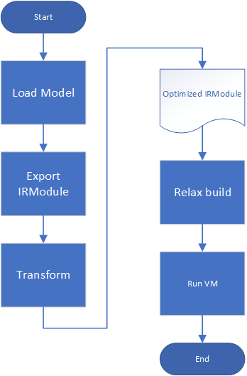

# Intro

In this document, I follow MLC-Course's Chapter 7 to explore ways of optimizing IRModule to fit TENET.

To recap, our primary goal is to estimate the cost of LLM with different quantization techniques on Hardware accelerator. below shows a typical MLC flow to run models on TVM relax VM.



In order to Integrate TENET, we thought of BYOC. There are two options

1. BYOC into TVM relax
   this can be done by bringing an already implemented hardware as library. Then map the operation patterns from the IRModule you need to execute, to the hardware. to do so, we can usse the relax.transform.FuseOpsByPattern method.
2. Use of graph optimization
   1. Modify TensorIR with built-in functions like scheduling, block and vectorize etc.
   2. Create an external TensorIR

## Use of Graph Optimization

### 1. Modify TensorIT

__Step flow__

1. Export the IRModule.
2. Lower the IRModule to TensorIR.
3. Look for "T_matmul_NN" block inside a given function.
4. Mutate the Code.

below show the python code used to transform the TIR of the FashionMNIST model in chapter 7. 

``` python
# Define the tiling pass
def tile_matmul(schedule, func_name, block_name, tile_i_factor, tile_j_factor):
    block_Y = schedule.get_block(block_name, func_name=func_name)
    i, j, k = schedule.get_loops(block_Y)
    i0, i1 = schedule.split(i, factors=[None, tile_i_factor])
    j0, j1 = schedule.split(j, factors=[None, tile_j_factor])
    schedule.reorder(i0, j0, i1, j1, k)
    schedule.reverse_compute_at(block_Y, i0)
    return schedule

# Create a transformation function to apply the tiling pass to all matmul functions
def apply_tiling_pass(mod, tile_i_factor, tile_j_factor):
    sch = Schedule(mod)
    for gv in mod.functions:
        func_name = gv.name_hint
        func = mod[gv]
        if isinstance(func, tvm.tir.PrimFunc):
            try:
                sch = tile_matmul(sch, func_name, "T_matmul_NN", tile_i_factor, tile_j_factor)
            except tvm.tir.schedule.schedule.ScheduleError:
                # If the block is not found, continue to the next function
                continue
    return sch.mod

# Register the custom pass
@tvm.ir.transform.module_pass(opt_level=0)
class TilingPass:
    def __init__(self, tile_i_factor, tile_j_factor):
        self.tile_i_factor = tile_i_factor
        self.tile_j_factor = tile_j_factor

    def transform_module(self, mod, ctx):
        return apply_tiling_pass(mod, self.tile_i_factor, self.tile_j_factor)

# Apply the pass to the original module

MLPModelTIR1 = LowerToTensorIRPass()(MLPModel)
tile_x, tile_y = 64, 64
tiling_pass = TilingPass(tile_x, tile_y)
tiling_pass1 = TilingPass(tile_x, tile_y)
with tvm.transform.PassContext(opt_level=3):
    transformed_mod = tiling_pass(MLPModelTIR1)
    transformed_mod1 = tiling_pass(MLPModelFinal)
```

## Experiment
I perform experiment by running the model on relax VM and extract the runtime duration

``` python
import torch
import torchvision

test_data = torchvision.datasets.FashionMNIST(
    root="data",
    train=False,
    download=True,
    transform=torchvision.transforms.ToTensor()
)
test_loader = torch.utils.data.DataLoader(test_data, batch_size=1, shuffle=True)
class_names = ['T-shirt/top', 'Trouser', 'Pullover', 'Dress', 'Coat',
               'Sandal', 'Shirt', 'Sneaker', 'Bag', 'Ankle boot']

img, label = next(iter(test_loader))
img = img.reshape(1, 28, 28).numpy()

import matplotlib.pyplot as plt

plt.figure()
plt.imshow(img[0])
plt.colorbar()
plt.grid(False)
plt.show()

print("Class:", class_names[label[0]])
data_nd = tvm.nd.array(img.reshape(1, 784))

print("Run the VM\nBaseline")
ex0 = relax.build(MLPModelTIR1, target="llvm")
vm0 = relax.VirtualMachine(ex0, tvm.cpu(), profile=True)
nd_res = vm0["main"](data_nd)

pred_kind = np.argmax(nd_res.numpy(), axis=1)
print("MLPModule Prediction:", class_names[pred_kind[0]])

report0 = vm0.profile("main", data_nd)
print()
#print(ex.as_text())
print()
print(report0)


print("\nRun the VM for MLC-course optimization tutorial")
ex1 = relax.build(MLPModelFinal, target="llvm")
vm1 = relax.VirtualMachine(ex1, tvm.cpu(), profile=True)
nd_res = vm1["main"](data_nd)

pred_kind = np.argmax(nd_res.numpy(), axis=1)
print("MLPModule Prediction:", class_names[pred_kind[0]])

report1 = vm1.profile("main", data_nd)
print()
#print(ex.as_text())
print()
print(report1)

print("Run the VM for my optimization 1")
ex2 = relax.build(transformed_mod, target="llvm")
vm2 = relax.VirtualMachine(ex2, tvm.cpu(), profile=True)
report2 = vm2.profile("main", data_nd)
#print(ex1.as_text())
print()
print(report2)

print("Run the VM for my optimization 2")
ex3 = relax.build(transformed_mod1, target="llvm")
vm3 = relax.VirtualMachine(ex3, tvm.cpu(), profile=True)
report3 = vm3.profile("main", data_nd)
#print(ex1.as_text())
print()
print(report3)
```

### Runtime duration

|        | baseline      | Fused matmul_add       | tiled_matmul | tiled_matmul+fused |
| -------------- | -------------- | -------------- | --------------- | ------------ |
| Total duration(us) | 353.32  | 304.37 | 364.41  | 312.16 |

