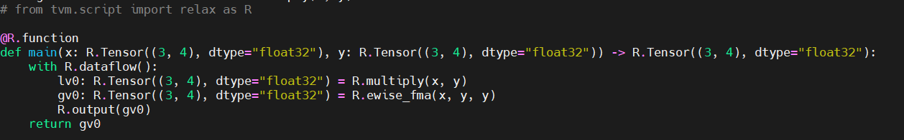
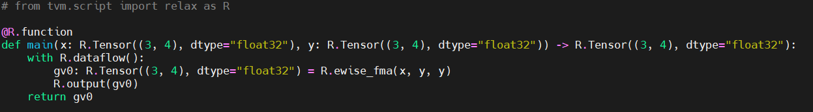
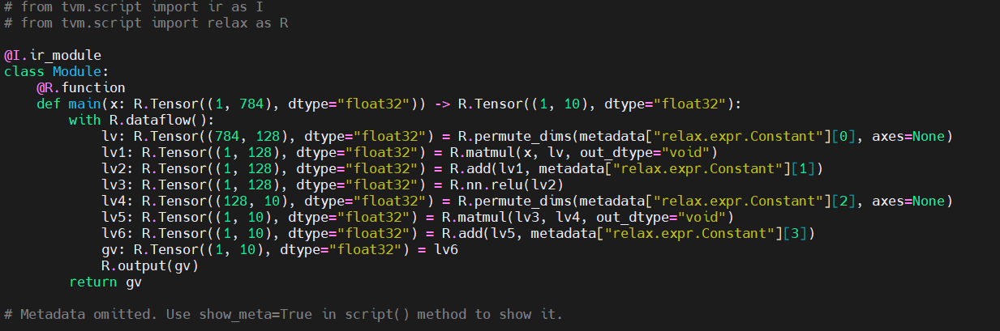
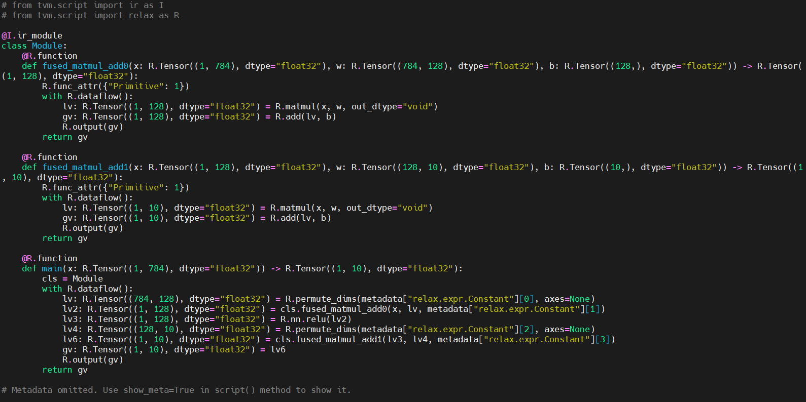

# Computational Graph Optimization

## Intro

This document summarizes key points of Chapter 7 of [MLC-Course](https://mlc.ai/index.html). In which theydiscuss how Computation Graphof MLC can be optimized.

## Pattern Match and rewriting

As most MLC process can be seen as transformation among tensor function, it is necessary to learn how transformations are done in both primitive tensor function described in [Chapter 2](https://mlc.ai/chapter_tensor_program/case_study.html#transformation) and high-level transformations among computational graphs.

An MLC program typicallyhas an IRModule that is made of a collection of functions, the function body is composed of a set of data structured referred to as absract syntax trees(AST).  

We might want to modify an IRModule for optimization. Pattern matching and rewriting is an option to do so.
Consider the following IRModule

``` python
@tvm.script.ir_module
class MyModule:
    @R.function
    def main(x: R.Tensor((3, 4), "float32"), y: R.Tensor((3, 4), "float32")):
        with R.dataflow():
            lv0 = relax.op.multiply(x, y)
            gv0 = relax.op.add(lv0, y)
            R.output(gv0)
        return gv0
```

The module contains 2 high-level operators, relax.op.multiply and relax.op.add. The main goal is to first fnd those 2 operators to then replace them with a call into relax.op.ewsie_fma operator.

The approach that is used to rwrite the module extensively uses extra tooling support of relax, in this case, __visitor pattern__. The code block is shown below

``` python
@relax.expr_functor.mutator
class EwiseFMARewriter(relax.PyExprMutator):
    def visit_call_(self, call):
        call = self.visit_expr_post_order(call)
        add_op = tvm.ir.Op.get("relax.add")
        multiply_op = tvm.ir.Op.get("relax.multiply")
        ewise_fma_op = tvm.ir.Op.get("relax.ewise_fma")

        if call.op != add_op:
            return call

        value = self.lookup_binding(call.args[0])
        if not isinstance(value, relax.Call) or value.op != multiply_op:
            return call

        fma_call = relax.Call(
            ewise_fma_op, [value.args[0], value.args[1], call.args[1]], None, None
        )
        return fma_call


updated_fn = EwiseFMARewriter().visit_expr(MyModule["main"])
updated_fn.show()
```

#### Breakdown of the code

* __class EwiseFMARewriter__: Inherits from relax.PyExprMutator, it's used to traverse and transform expressions in Relax. It looks specifically fofr expressions that can be rewritten to use __ewise_fma__(element-wised fused maultiply-add) operations.
* __def visit_call__: Method that overrides the *visit_call* of the parent class. It is called when the mutator encounters a *call* expression.
* __Visiting expression__: This line traverses the call expression in a post-order manner, meaning it processes child nodes before the parent node.
```call = self.visit_expr_post_order(call)```
* __Fetching Operations__: These lines fetch the operation definitions for addition, multiplication and fused multiply_add.
  
  ```
  add_op = tvm.ir.Op.get("relax.add")
  multiply_op = tvm.ir.Op.get("relax.multiply")
  ewise_fma_op = tvm.ir.Op.get("relax.ewise_fma")
  ```

* __Checking for addition op__: Check if current operation is an addition. iI not, the call is return unchanged

  ```
  if call.op != add_op:
    return call
  ```

* __Looking Up Binding__: The code looks up the value bound to the first argument of the addition operation.

  ```
  value = self.lookup_binding(call.args[0])
  ```

* __Checking for Multiplication__: It checks if the looked-up va;ue is a call to multiplication operation. If it is not, the method returns the call unchanged.

  ```
  if not isinstance(value, relax.Call) or value.op != multiply_op:
    return call
  ```

* __Creating FMA Call__: If the conditions are met (i.e., an addition operation where the first argument is a multiplication operation), this creates a new call to the ewise_fma operation. The arguments for this operation are:

  * The first argument of the multiplication (value.args[0])
  * The second argument of the multiplication (value.args[1])
  * The second argument of the addition (call.args[1])

The updated IRModule is shown below.

This IRModule will be then gone through another pass to remove unused function calls.

```
relax.analysis.remove_all_unused(updated_fn).show()
```

The final version is then


## Fuse Linear and ReLU

In this part, they fuse the dense and add operations into a single group by following these steps below:

* Identify mamul and add patterns
* Generate another fused sub-function that calls into the matmul and add operators.
* Replace matmul and add with the fused sub-functions

They first reconstructed the FashionMNIST MLP model by using high-level operators such as relax.op.add and relax.op.matmul. The code is shown below:

``` python
import pickle as pkl

mlp_params = pkl.load(open("fasionmnist_mlp_params.pkl", "rb"))

def create_model():
    bb = relax.BlockBuilder()
    x = relax.Var("x", relax.TensorStructInfo((1, 784), "float32"))
    w0 = relax.const(mlp_params["w0"], "float32")
    b0 = relax.const(mlp_params["b0"], "float32")
    w1 = relax.const(mlp_params["w1"], "float32")
    b1 = relax.const(mlp_params["b1"], "float32")
    with bb.function("main", [x]):
        with bb.dataflow():
            lv0 = bb.emit(relax.op.matmul(x, relax.op.permute_dims(w0)))
            lv1 = bb.emit(relax.op.add(lv0, b0))
            lv2 = bb.emit(relax.op.nn.relu(lv1))
            lv3 = bb.emit(relax.op.matmul(lv2, relax.op.permute_dims(w1)))
            lv4 = bb.emit(relax.op.add(lv3, b1))
            gv = bb.emit_output(lv4)
        bb.emit_func_output(gv)

    return bb.get()

MLPModel = create_model()
MLPModel.show()
```

The corresponding IRModule


In order to modify the IRModule, Similar approach that was used in previous section is used. The code is the following, followed by the updated IRModule.

``` python
@relax.expr_functor.mutator
class MatmulAddFusor(relax.PyExprMutator):
    def __init__(self, mod: IRModule) -> None:
        super().__init__()
        self.mod_ = mod
        # cache pre-defined ops
        self.add_op = tvm.ir.Op.get("relax.add")
        self.matmul_op = tvm.ir.Op.get("relax.matmul")
        self.counter = 0

    def transform(self) -> IRModule:
        for global_var, func in self.mod_.functions.items():
            if not isinstance(func, relax.Function):
                continue
            # avoid already fused primitive functions
            if func.attrs is not None and "Primitive" in func.attrs.keys() and func.attrs["Primitive"] != 0:
                continue
            updated_func = self.visit_expr(func)
            updated_func = relax.analysis.remove_all_unused(updated_func)
            self.builder_.update_func(global_var, updated_func)

        return self.builder_.get()

    def visit_call_(self, call):
        call = self.visit_expr_post_order(call)

        def match_call(node, op):
            if not isinstance(node, relax.Call):
                return False
            return node.op == op

        # pattern match matmul => add
        if not match_call(call, self.add_op):
            return call

        value = self.lookup_binding(call.args[0])
        if value is None:
            return call

        if not match_call(value, self.matmul_op):
            return call

        x = value.args[0]
        w = value.args[1]
        b = call.args[1]

        # construct a new fused primitive function
        param_x = relax.Var("x" ,relax.TensorStructInfo(x.struct_info.shape, x.struct_info.dtype))
        param_w = relax.Var("w" ,relax.TensorStructInfo(w.struct_info.shape, w.struct_info.dtype))
        param_b = relax.Var("b" ,relax.TensorStructInfo(b.struct_info.shape, b.struct_info.dtype))

        bb = relax.BlockBuilder()

        fn_name = "fused_matmul_add%d" % (self.counter)
        self.counter += 1
        with bb.function(fn_name, [param_x, param_w, param_b]):
            with bb.dataflow():
                lv0 = bb.emit(relax.op.matmul(param_x, param_w))
                gv = bb.emit_output(relax.op.add(lv0, param_b))
            bb.emit_func_output(gv)

        # Add Primitive attribute to the fused funtions
        fused_fn = bb.get()[fn_name].with_attr("Primitive", 1)
        global_var = self.builder_.add_func(fused_fn, fn_name)

        # construct call into the fused function
        return relax.Call(global_var, [x, w, b], None, None)

@tvm.ir.transform.module_pass(opt_level=2, name="MatmulAddFuse")
class FuseDenseAddPass:
    """The wrapper for the LowerTensorIR pass."""
    def transform_module(self, mod, ctx):
        return MatmulAddFusor(mod).transform()


MLPFused = FuseDenseAddPass()(MLPModel)
MLPFused.show()
```



### Why Creating a Sub-function

In the above example, they created two sub-functions with the prefix fuse_matmul_add. These sub-function bodies contain information about the operations performed by the fused operator. An alternative to this rewriting is simply creating a separate primitive operation for the fused operator (like ewise_fma). However, as they are looking into fusing more operators, there can be an exponential amount of possible combinations. A sub-function that groups the fused operation together provides the same amount of information for follow-up code lowering without introducing a dedicated high-level operator for each fusion pattern.

## Map to Tensor

The Fused IRModule only contains calls into high-level operations. It's important if we want to optimize and generate low-level code, to translate those high-level primitives function into corresponding TensorIR functions.

Below is the code to remaps high-level operations to the coreresponding TensorIR functions.

``` python
@relax.expr_functor.mutator
class LowerToTensorIR(relax.PyExprMutator):
    def __init__(self, mod: IRModule, op_map) -> None:
        super().__init__()
        self.mod_ = mod
        self.op_map = {
            tvm.ir.Op.get(k): v for k, v in op_map.items()
        }


    def visit_call_(self, call):
        call = self.visit_expr_post_order(call)

        if call.op in self.op_map:
            return self.op_map[call.op](self.builder_, call)
        return call

    def transform(self) -> IRModule:
        for global_var, func in self.mod_.functions.items():
            if not isinstance(func, relax.Function):
                continue
            updated_func = self.visit_expr(func)
            self.builder_.update_func(global_var, updated_func)

        return self.builder_.get()


def map_matmul(bb, call):
    x, w = call.args
    return bb.call_te(topi.nn.matmul, x, w)

def map_add(bb, call):
    a, b = call.args
    return bb.call_te(topi.add, a, b)

def map_relu(bb, call):
    return bb.call_te(topi.nn.relu, call.args[0])

def map_transpose(bb, call):
    return bb.call_te(topi.transpose, call.args[0], )

op_map = {
  "relax.matmul": map_matmul,
  "relax.add": map_add,
  "relax.nn.relu": map_relu,
  "relax.permute_dims": map_transpose
}

@tvm.ir.transform.module_pass(opt_level=0, name="LowerToTensorIR")
class LowerToTensorIRPass:
    """The wrapper for the LowerTensorIR pass."""
    def transform_module(self, mod, ctx):
        return LowerToTensorIR(mod, op_map).transform()


MLPModelTIR = LowerToTensorIRPass()(MLPFused)
MLPModelTIR.show()
```

### Breakdown of the code

* __visit_call Method__: This method is called for each call expression in the IR.
  * visit_expr_post_order: Visits the expression in post-order traversal.
  * Check if Operation is in op_map: If the operation of the call is in the op_map, the corresponding function from op_map is called, transforming the call into a TensorIR operation.
  * Return Transformed or Original Call: Returns the transformed call if it was in op_map, otherwise returns the original call.
* __Transform Method__: This method applies the transformation to all functions in the module.
  * Iterate Over Functions: Iterates over all functions in the module.
  * Check Function Type: Only processes functions that are instances of relax.Function
  * Update Function: Uses visit_expr to apply the mutator to each function and updates the function in the module builder.
  * Return Updated Module: Returns the transformed module.
* __Mapping Functions__: These functions define how specific Relax operations should be transformed into TensorIR operations.
  * map_matmul: Transforms a matrix multiplication operation.
  * map_add: Transforms an addition operation
  * map_relu: Transforms a ReLU operation
  * map_transpose: Transforms a transpose operation
  

