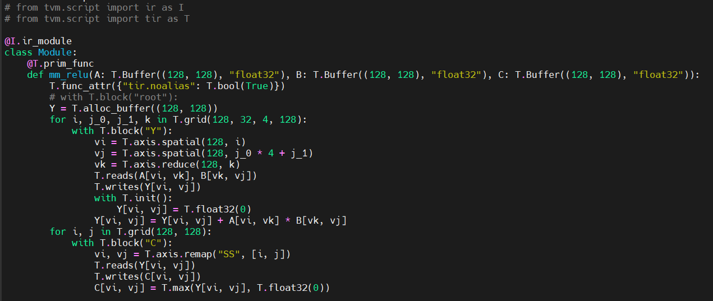
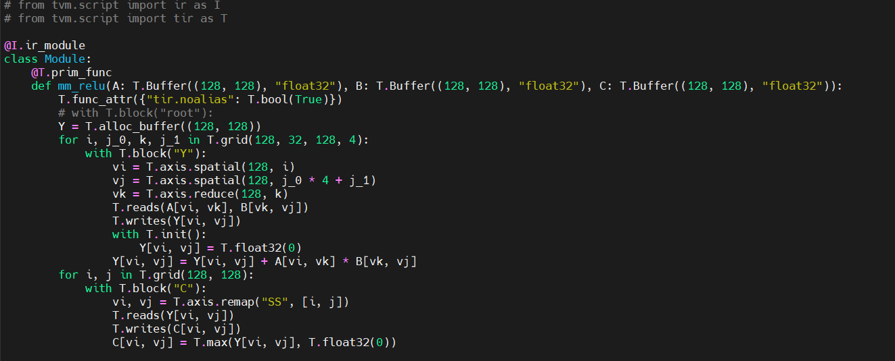
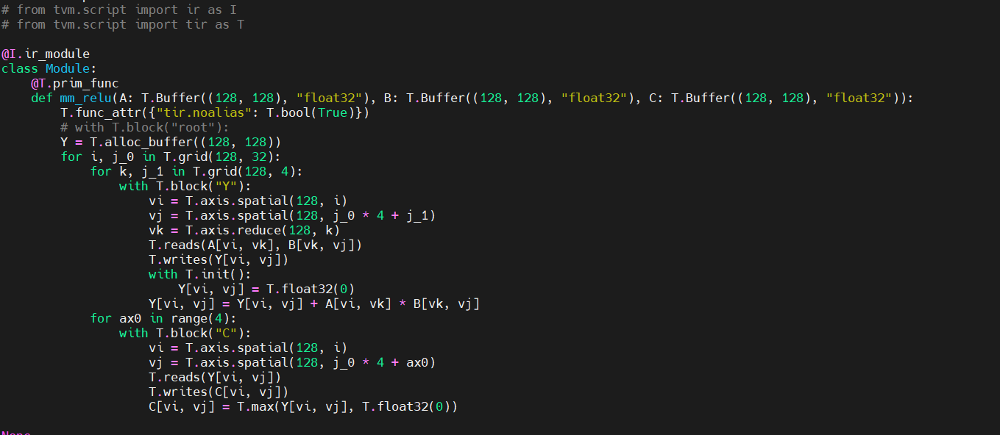
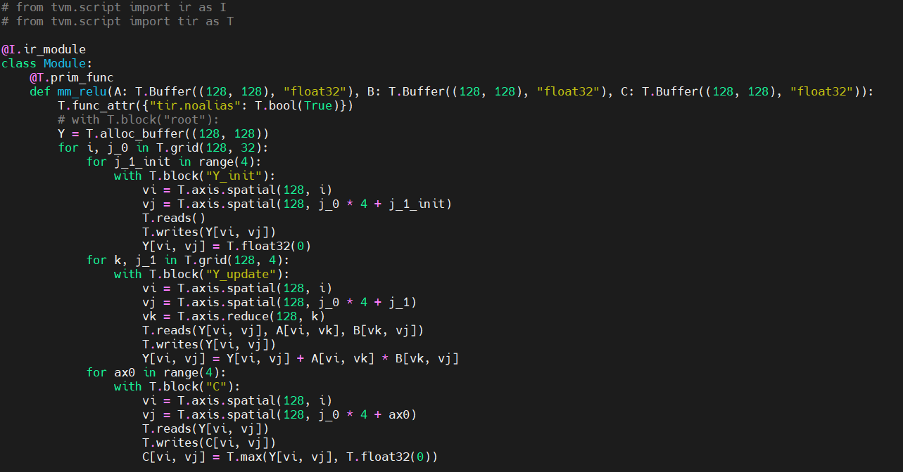
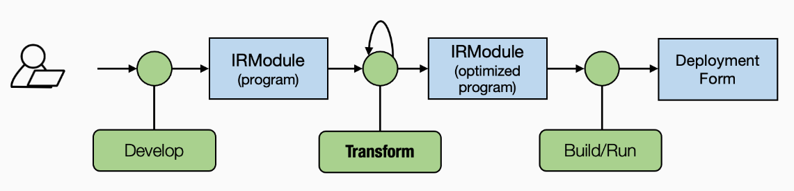

# Tensor Program Case Study
## Introduction
This document takes and summarizes the key points of [part 4](https://mlc.ai/chapter_tensor_program/case_study.html) of Chapter of 2 of [MLC-Course](https://mlc.ai/index.html). The later showcases the parameters of a TensorIR program. 

A typical TensorIR program contains 3 main elements: (Multi-dimensional)buffers(hold input, output and immediate result), loop nests that drive the compute iterations and the computation statements.


## Tensor Program 
``` python
@tvm.script.ir_module
class MyModule:
    @T.prim_func
    def mm_relu(A: T.Buffer((128, 128), "float32"),
                B: T.Buffer((128, 128), "float32"),
                C: T.Buffer((128, 128), "float32")):
        T.func_attr({"global_symbol": "mm_relu", "tir.noalias": True})
        Y = T.alloc_buffer((128, 128), dtype="float32")
        for i, j, k in T.grid(128, 128, 128):
            with T.block("Y"):
                vi = T.axis.spatial(128, i)
                vj = T.axis.spatial(128, j)
                vk = T.axis.reduce(128, k)
                with T.init():
                    Y[vi, vj] = T.float32(0)
                Y[vi, vj] = Y[vi, vj] + A[vi, vk] * B[vk, vj]
        for i, j in T.grid(128, 128):
            with T.block("C"):
                vi = T.axis.spatial(128, i)
                vj = T.axis.spatial(128, j)
                C[vi, vj] = T.max(Y[vi, vj], T.float32(0))
```

## Parts of TensorIR program
1. Function Parameters and Buffers
```python
    @T.prim_func
    def mm_relu(A: T.Buffer((128, 128), "float32"),
                B: T.Buffer((128, 128), "float32"),
                C: T.Buffer((128, 128), "float32")):
        T.func_attr({"global_symbol": "mm_relu", "tir.noalias": True})
```
In this mm_relu, there are 2 input matrices(A, B) and 1 output matrix(C). the type of the matrices is T.buffer with shape 128x128 and float32 as data type. 

2. Loop iterations
```python 
# TensorIR
for i, j, k in T.grid(128, 128, 128):

# numpy
for i in range(128):
    for j in range(128):
        for k in range(128):

```
To write nested for-loop, T.grid is used, where the loop bounds ar given as (i, j, k) for a 3 nested loop. 

3. Computational Block
``` python
# TensorIR
with T.block("Y"):
    vi = T.axis.spatial(128, i)
    vj = T.axis.spatial(128, j)
    vk = T.axis.reduce(128, k)
    with T.init():
        Y[vi, vj] = T.float32(0)
    Y[vi, vj] = Y[vi, vj] + A[vi, vk] * B[vk, vj]

# coressponding numpy code
vi, vj, vk = i, j, k
if vk == 0:
    Y[vi, vj] = 0
Y[vi, vj] = Y[vi, vj] + A[vi, vk] * B[vk, vj]
```
For the computational block, the TensorIR contains an additional construct called T.block. The block contains additional information as compared to Numpy code, such as the block axis. The key properties of the latter is as follow.

``` python
[block_axis] = T.axis.[axis_type]([axis_range], [mapped_value])
```
the block axis lines can also be written with the following 
``` python
vi, vj, vk = T.axis.remap("SSR", [i, j, k])
```
where SSR means the properties of each axes are "spatial", "spatial", "reduce".

Hence the program can be written as 
``` python 
@tvm.script.ir_module
class MyModuleWithAxisRemapSugar:
    @T.prim_func
    def mm_relu(A: T.Buffer((128, 128), "float32"),
                B: T.Buffer((128, 128), "float32"),
                C: T.Buffer((128, 128), "float32")):
        T.func_attr({"global_symbol": "mm_relu", "tir.noalias": True})
        Y = T.alloc_buffer((128, 128), dtype="float32")
        for i, j, k in T.grid(128, 128, 128):
            with T.block("Y"):
                vi, vj, vk = T.axis.remap("SSR", [i, j, k])
                with T.init():
                    Y[vi, vj] = T.float32(0)
                Y[vi, vj] = Y[vi, vj] + A[vi, vk] * B[vk, vj]
        for i, j in T.grid(128, 128):
            with T.block("C"):
                vi, vj = T.axis.remap("SS", [i, j])
                C[vi, vj] = T.max(Y[vi, vj], T.float32(0))
```

More information can be consulted on the MLC-course website.

## Transformation
In general MLC flows its a matter of Module transformation of primitive tensor functions from higher level to lower ones. The TVM script offers some tools to transform the a Module from one variant to another. 

For instance, we can split a loop into 2 and rearrange the loop order. The following steps show how to do so.
1. Create a Schedule helper class with the IRModule to modify as input.
``` python
sch = tvm.tir.Schedule(MyModuleWithAxisRemapSugar)
```
2. Perform the following operations to obtain a reference to block Y and corresponding loops.
``` python 
block_Y = sch.get_block("Y", func_name="mm_relu")
i, j, k = sch.get_loops(block_Y)
```

3. Perform the transformations
    a. Perform the loop splitting operatrion  and check the updated IRModule. The loop we are spliting is the j  loop.
    ``` python
    j0, j1 = wch.split(j, factors=[None, 4])
    ```
    And the change can be seen in the following figure.
    

    b. Perform the loop reordering with the followint method
    ``` python
    sch.reorder(j0, k, j1)
    ```
    

There are other methods that can be used to get other variant of the TensorIR such as _reverse_compute_at()_ that will allow us to move an entire computation block to an inner loop. for example, below code will move block C to inner loop of "Y"

``` python
block_C = sch.get_block("C", "mm_relu")
sch.reverse_compute_at(block_C, j0)
```


After the loop transformatons, decomposite_reduction() can be used to move the initialization of block Y's element seperate from the reduction update.
``` python
sch.decompose_reduction(block_Y, k)
```


### Create and Interact with TensorIR
TensorIR function can be created by using Tensor Expression or directly write it in TVMScript(Above example)

* Generate a TensorIR with TE
    ``` python 
    from tvm import te

    A = te.placeholder((128, 128), "float32", name="A")
    B = te.placeholder((128, 128), "float32", name="B")
    k = te.reduce_axis((0, 128), "k")
    Y = te.compute((128, 128), lambda i, j: te.sum(A[i, k] * B[k, j], axis=k), name="Y")
    C = te.compute((128, 128), lambda i, j: te.max(Y[i, j], 0), name="C")
    ```
    TE is a domain-specific language that describes a sequence of computations via an expression-like API. 

    The TensorIR function can then b created with the lines below.
    ``` python
    te_func = te.create_prim_func([A, B, C]).with_attr({"global_symbol": "mm_relu"})
    MyModuleFromTE = tvm.IRModule({"mm_relu": te_func})
    ```



